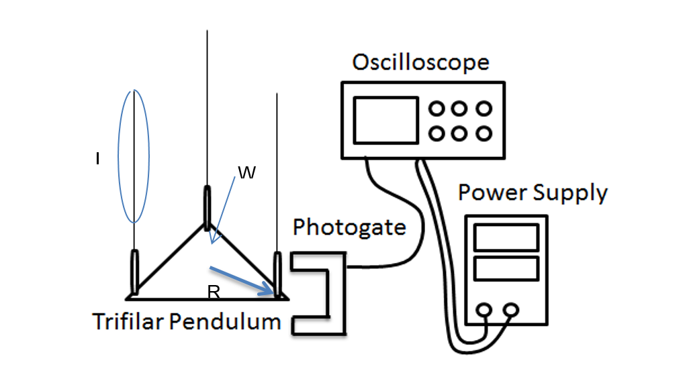

```{r, setup, include = FALSE}
library(knitr)
opts_knit$set(root.dir = '../')
opts_chunk$set(echo = TRUE, collapse = TRUE)
```

```{r}
# load packages
suppressPackageStartupMessages(library(dplyr))
library(tidyr)
library(stringr)
library(readr)
```

```{r}
#import image of pedulum setup
#
```

```{r}
#import trial data and examine structure 
trial_data <- read_csv('data/data_original.csv')
#glimpse(trial_data)
```

```{r}
#calculate mean and standard deviation of Period and I
mean_period <- mean(trial_data$Period)
mean_i <- mean(trial_data$I)
stdev_period <- sd(trial_data$Period)
stdev_i <- sd(trial_data$I)
#create a row with the mean and standard deviation of the Period
meanrow <- data.frame(Trial="Mean",Period = mean_period, I = mean_i)
#create a row with the mean and standard deviation of I
stdevrow <- data.frame(Trial = "Standard Deviation", Period = stdev_period, I = stdev_i)
#attach the row with the mean and stdev of the Period to the original data
data_temp <- rbind(trial_data,meanrow)
#attach the row with the mean and stdev of I to the temporary data set
data_final <- rbind(data_temp,stdevrow)
```

```{r}
write.csv(data_final, "results/01_data_gathered.csv", row.names = FALSE)
```

